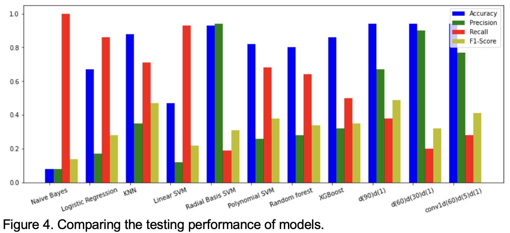

## Project Name 
Credit Card Fraud Detection (Group Project)

## Summary
Given a dataset of credit card transactions, we performed preprocessing, resampling, and supervised learning to predict fraudulant transactions. We also compared models based on accuracy, precision, recall and f1-score. 

Details can be found in documents/Final Report.pdf.  

  

## Dataset
IEEE-CIS Fraud Detection: https://www.kaggle.com/c/ieee-fraud-detection/discussion/101203

## 1. Preprocessing
### Dropping data
- Remove features not apprpriate for in our process such as Transaction ID and TransactionDT (delta time) 
- Remove columns with more than a threashold-percent of NaNs 
- Fill NaN in columns with column means 

### Dimensionality reduction 
- After min-max normalization, remove features with variance lower than threshold since features essentially constant do not help the fitting. 
- Remove features with high correlation to other features since it can be redundant information when fitting 
- Perform PCA and standardize data beforehand (if a feature shows high variance, this may dominate the principal components). 

### PCA 
- Standardize data (mean 0 variance 1) 
- Perform PCA with scikit-learn 

## 2. Resampling with SMOTE
The givien data is skewed towards transactions which are not fradulent, we will use SMOTE to sinthesize more fradulent transation data points to have a 1:1 ratio of the classes.  

## 3. Supervised learning 
Applied kNN, NBayes, Linear Regression, SVM, Neural Networks (FFN, CNN), Random Forest, and XG Boost to predict fraudulant transactions.

